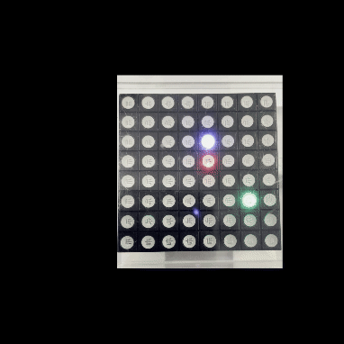

# RainbowDuinoSnake

## 概要

[RainbowDuino](https://wiki.seeedstudio.com/Rainbowduino/)+8x8のLEDボードで動くゲームです。

## 動かし方

- [PlatformIO](https://platformio.org/)を使用してビルドと書き込みを行います。
- ゲームが起動したらシリアルモニタもしくは専用アプリケーションを使用して操作コマンドを送信します。
  - コマンドはw,a,s,dの4パターン、asciiコードで送信します。
- 蛇が前進し続けるので、進行方向を操作して緑色の餌に接触させ、蛇を成長させましょう。